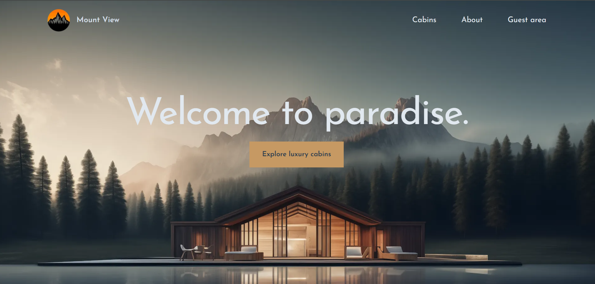
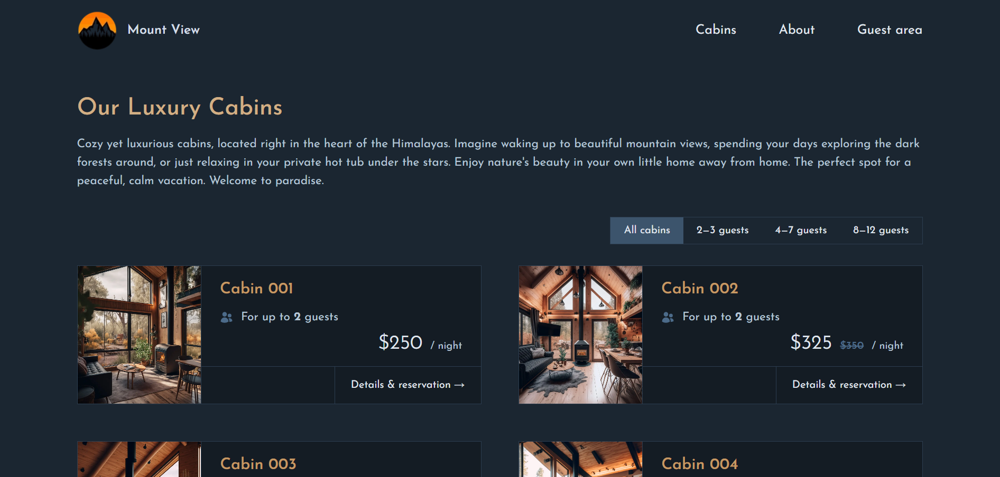
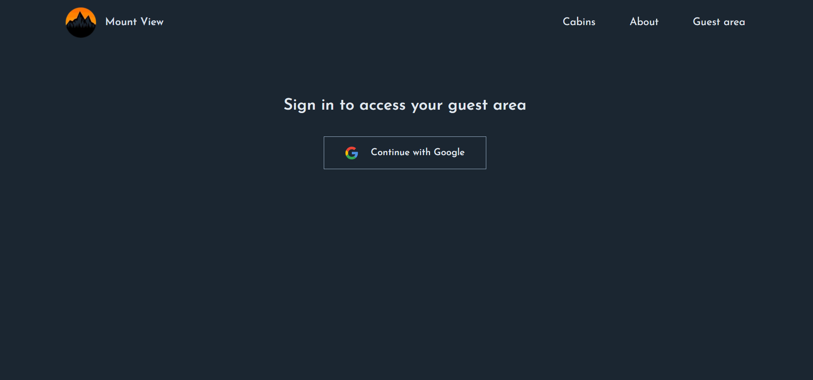

# 🏔️ Mount View – Hotel Website

**Mount View** is a modern hotel website designed to provide a seamless user experience for browsing available rooms, making bookings, and exploring the amenities of the hotel. Built with **Next.js**, **TailwindCSS**, and **Supabase**, this platform offers a clean and intuitive interface for potential guests to explore and book rooms.

---

## 🌟 Features

- **Browse Rooms & Amenities**  
  Explore a variety of room options and hotel amenities with high-quality images and detailed descriptions.

- **Room Availability & Booking**  
  Check real-time availability and easily make bookings for your preferred dates.

- **Responsive Design**  
  A fully responsive design optimized for desktop, tablet, and mobile devices, ensuring a smooth browsing experience across all platforms.

- **User-friendly Interface**  
  Clean, modern UI built with **TailwindCSS**, providing an effortless user experience for hotel guests.

- **Secure Booking**  
  Secure booking flow using **NextAuth.js** to ensure user safety during the reservation process.

---

## ⚙️ Tech Stack

- **Next.js** – React framework for building fast and SEO-friendly websites.
- **Supabase** – Backend-as-a-Service for managing real-time data and ensuring smooth booking experiences.
- **TailwindCSS** – Utility-first CSS framework for modern, responsive design.
- **NextAuth.js** – Authentication for managing user sessions and bookings securely.
- **React** – Component-based UI library for building interactive web pages.

---

## 🖼️ Screenshots

  
   
  
  
 

